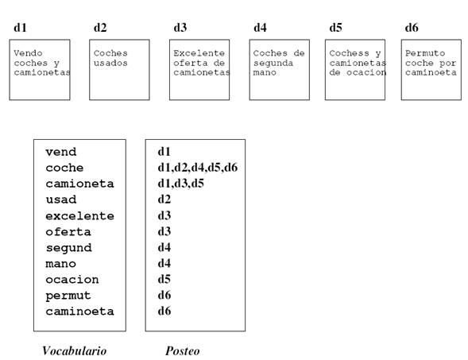

# Práctica 2 - Práctica de busca

**Marcos Fernández Pichel**  
Curso 2026-2027 · Grao en Intelixencia Artificial - USC

A Recuperación da Información (RI) é unha área de investigación que, dada unha consulta dun/dunha usuario/a, trata de atopar os documentos relevantes para ela. Trátase da ciencia que está detrás dos algoritmos dos motores de busca como Google. Como os/as usuarios/as escriben en linguaxe natural, é unha tarefa moi relacionada coas tecnoloxías da linguaxe.

En todo problema de busca, sempre imos ter:

- Un corpus de documentos ($C$).
- Unha ou varias consultas ($q$).
- Un índice invertido ($I$).

O índice invertido é a estrutura clave que permite emparellar consultas e documentos de maneira eficiente.

Ademais, en investigación e avaliación da RI tamén se empregan os chamados xuízos de relevancia (*relevance judgments* ou *qrels*), que indican que documentos do corpus son realmente relevantes para cada consulta. Estes xuízos adoitan ser elaborados por persoas expertas ou anotadores/as e constitúen a “verdade” (*ground truth*) que permite avaliar a calidade dun sistema de recuperación mediante métricas como NDCG@k, Precision@k, Recall@k ou Mean Average Precision (MAP@k).

*Figura 1. Estructura de índice invertido.*

Nesta práctica compararemos representacións vectoriais clásicas e *embeddings* nunha tarefa de Recuperación da Información (RI).

## 1. Tarefas a realizar

### 1.1. Preparación do corpus

O noso corpus ($C$) vai ser a colección CACM, un corpus de artigos científicos:

- [Colección CACM](http://www.search-engines-book.com/collections/)

O corpus de documentos está en formato HTML, polo que deberedes utilizar algunha libraría de Python para eliminar as etiquetas HTML e indexar unicamente o texto plano. Por exemplo, podedes empregar [BeautifulSoup](https://www.crummy.com/software/BeautifulSoup/bs4/doc/).

### 1.2. Creación do índice con Whoosh

Unha vez cargada a colección, deberedes crear o voso primeiro índice. A primeira libraría que utilizaremos será [Whoosh](https://whoosh.readthedocs.io/en/latest/intro.html), que internamente representa os documentos como frecuencias de palabras.[^1]

Para crear o índice deberedes definir un esquema de campos para os documentos no que, como mínimo:

- Se almacene o título como un campo separado, asumindo que o título de cada documento é sempre a primeira oración do texto.
- Se almacene outro campo `body` que conteña o texto completo do documento, incluíndo o título.
- Se garde o nome do ficheiro, sen a extensión HTML, como un campo identificador independente.

### 1.3. Avaliación batch das consultas

Dado o ficheiro de consultas (*queries*) da colección CACM (só o ficheiro *processed queries*), trátase de realizar unha avaliación de tipo *batch* das mesmas, consistente en realizar iterativamente os seguintes pasos:

1. Ler a consulta do ficheiro e lanzala contra o índice.
2. Recuperar os 10 primeiros resultados.
3. Calcular, para eses 10 primeiros resultados, a Precisión@10 e o *Reciprocal Rank* (RR) da busca.

   Para iso, é necesario coñecer cales son os documentos relevantes para cada consulta. Esta información atópase no ficheiro [`cacm.rel`](http://www.search-engines-book.com/data/cacm.rel), que contén os xuízos de relevancia (*relevance judgments*) do conxunto de consultas.

   En concreto:

   - A primeira columna corresponde ao número da consulta.
   - A terceira columna corresponde ao identificador do documento.
   - A cuarta columna indica cun valor 1 os documentos relevantes para esa consulta.

   Recoméndase ler esta información ao comezo do programa para dispoñer dun método eficiente de acceso aos documentos relevantes de cada consulta.

4. O programa deberá informar individualmente da Precisión@10 e do RR de cada consulta e, ao finalizar, mostrar o valor medio de ambas métricas, calculado sobre o conxunto completo de consultas do *benchmark*.
5. Para estas buscas, empregaremos o modelo por defecto de Whoosh: BM25F.[^2] Realizade os experimentos empregando as seguintes variantes:

   - Busca unicamente sobre o campo `title` utilizando o modelo BM25F.
   - Busca unicamente sobre o campo `body` utilizando o modelo BM25F.

### 1.4. Busca mediante embeddings e FAISS

En segundo lugar, realizaremos buscas con representacións vectoriais con carga semántica (*embeddings*) dos documentos e das consultas. A libraría de referencia para este propósito é [FAISS](https://github.com/facebookresearch/faiss). Nesta parte, abonda con que indexedes unicamente o campo `body` dos documentos.[^3]

1. Adestrade un modelo de Word2Vec utilizando o corpus $C$ e xerade o índice con FAISS.

   Para obter os *embeddings* dos documentos, podedes representar cada documento como a media dos *embeddings* das súas palabras.
2. Repetide o proceso empregando agora os modelos preadestrados `glove-twitter-25` e `word2vec-google-news-300`.
3. Finalmente, como introdución aos *Transformers*, xerade un índice FAISS utilizando modelos SBERT preadestrados:

   - [Modelos SBERT preadestrados](https://www.sbert.net/docs/sentence_transformer/pretrained_models.html)

4. Para cada un dos modelos anteriores, facede buscas mediante similaridade semántica para as mesmas consultas que no índice léxico e comparade os resultados.

## 2. Entregables

Deberedes entregar un Python Notebook coa vosa práctica, que deberá chamarse `apelidos_nome_entregable2.ipynb`.

É fundamental que o Notebook sexa autoexplicativo en todos os pasos, combinando celas de texto con celas de código e mostrando explicitamente os resultados, sen necesidade de volver executar as celas.

Recordade: o único entregable obrigatorio é o último, pero é preciso acadar unha nota igual ou superior a 5 nas prácticas para superar a asignatura.

Á parte da entrega do informe, esta práctica avaliarase cunha defensa ante o profesor, avaliada con rúbrica, na sesión posterior á entrega.

## 3. Valoración e data de entrega

Esta práctica ten unha valoración de 1 punto sobre o total de 10 puntos da parte práctica da materia.

**Data límite de entrega:** 20 de outubro ás 23:59.

[^1]: Se vos fixades, isto é moi semellante á matriz documento-termo que vimos no Tema 1.
[^2]: Verémolo en profundidade no Tema 5.
[^3]: Para unha colección de só uns poucos miles de documentos, `IndexFlatL2` é unha boa opción.
